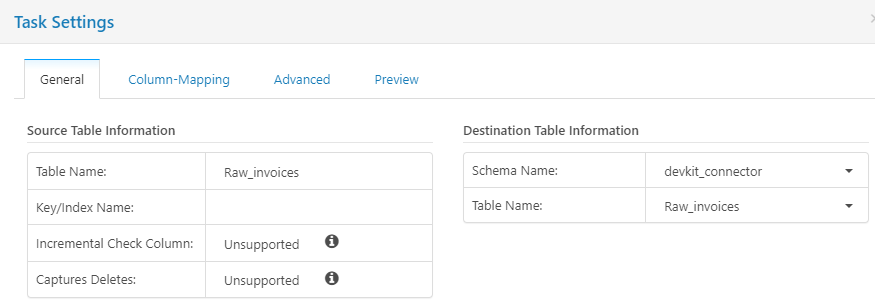

# Extractor guidelines

To provide the connection and integration between the source system and the destination server, Cdata connectivity platform will be used. The detailed information about this platform can be find [here](https://www.cdata.com/solutions/connectivity/).

In this document, the instructions for the extractor configurations will be provided.

## Installation

TBD

## Connection

### Configuration

    To create the connection between the source and the destination system, the steps are defined as:
        1- Setup for the source system
        2- Setup for the destination
        3- Job scheduling

Depending on the type of the source system, Cdata offers different connection formats. To get a detailed information on the connector types and the source systems, see [here](https://www.cdata.com/drivers/).

To provide the configurations for the extraction pipeline, web application interface of "Cdata Sync Admin Console" is utilised.

#### Setup for the source system

In `Connections` page, suitable source system can be chosen:

#### Setup for the destination system

Sql server or Snowflake Data Cloud will be used as a destination for the datapipeline. The selection for the destination system can be made within `Connections` page `Destination` section.

#### Job configuration

To provide the connectivity and trigger the data extraction between the source system and the destination, the jobs are established and configured using the tables that are obtained from the source system.

    1 - Using the left "Add job" button, source and destination are chosen.

    2 - In job settings, relevant tables are chosen using the "Add tables" button. For each file and the corresponding table, jobs should be configured seperately.

    3 - After the tables are defined, the task settings can be viewed by clicking on the listed task.

    4- In "General" section, Schema Name is defined under the Destination Table Information.

    5- To change the mapping or to provide additional settings for the columns, "Column-mapping" section is used.

    6- Additional replication options are also available on the "Advanced" section.
    
    7- After the configurations are set, data can be viewed using "Preview" section.

# Example data extraction 

## Source and destination settings

- CSV connection settings:
The CSV file connection can be set either using a local file path or an online document storage using the correct credentials. Local file location is provided for this example.

In the "Advanced" page, you can find the `data formatting` section for the specified connection type. In this section, manual file formatting can be realized if needed. The file format can also be changed in the `FMT` button in `Data formatting`. Since the connection type is marked as CSV connection, we will be using .csv files. If the files are in .tsv format, "TabDelimited" option needs to be chosen after the name of the file is changed from ".tsv" to ".csv" in the file location.

-SQL server settings:
The connection for SQL server is defined as below:

## Job Scheduling

When the configurations are set for both source and destination on CDATA, job scheduling can be customized according to the data extraction frequency needed.

To complete the datapipeline, and to be able to insert the extracted source data to correct schema within the SQL server, schema name needs to be defined on the job settings:

The source folder can consist of multiple files. In that case, each file can be specified within the task settings separately, or together by using `Add custom query` option. The related jobs should also be run separately for each file.

After the settings are completed for the related job, the extraction and load can be initialized using "Run" command:

The logs created for this task can be found in the `Logging and history` section in `Job settings` page.

The data records transferred to the destination server can be found under the related schema with the file name defined in the source settings.

