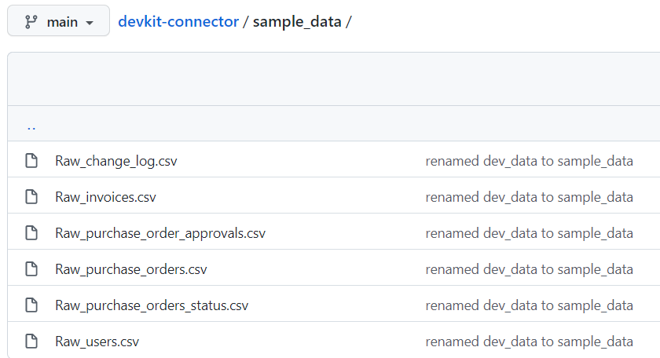

# Load-from-file

This document describes how to extract data for Devkit-connector. The data is loaded from CSV files and stored in MS SQL server using CData Sync.

The platform also enables using different source and destination connectivity options. The detailed information can be found [here](https://cdn.cdata.com/help/ASG/sync/Connections.html).

## Install Cdata sync

To install CData Sync, follow the instructions on [link](https://www.cdata.com/sync/download/).

### Licensing for the platform

TBD

## Configuration

First the source and destination connections should be defined in CDATA. For general instructions on how to create connections and jobs in CData, see [here](https://cdn.cdata.com/help/ASG/sync/Configuring-Jobs.html).

### Create source connection:

    1- Define a new connection of type **System.Data.CData.CSV**
    2- Set the URI to the path where the CSV files are stored.


The CSV file connection can be set either using a local file path or an online document storage using the correct credentials. Local file location is provided for this example. For devkit-connector, related sample data can be found in `sample_data/`.



In the "Advanced" page, you can find the `data formatting` section for the specified connection type. In this section, manual file formatting can be applied if needed.

### Create destination connection

    1- Define a new connection of type **System.Data.SqlClient**
    2- Configure the settings to connect to your MS SQL staging database.
    

### Create a job

    1- Create a new job
    2- Set the source connection to the CSV connection that was just created.
    3- Set the destination connection to the MS SQL connection that was just created.
    4- Press Add custom query, and enter the following query:

    ```json
    {
        REPLICATE ....;
        REPLICATE ....;
    }
    ```

    5- In advance job settings, enter the `Destination Schema`:
    
    6- Press Save changes.

### Execution

To run the extraction, use the script (see `extractor_automation.md` for more information) that executes the Job that was just created.
