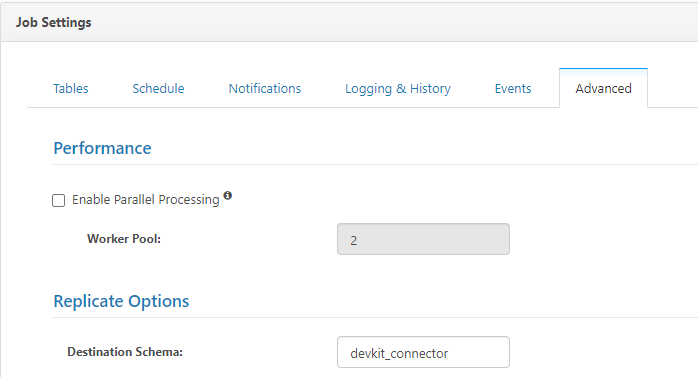

# Load-from-file

This document describes how to extract data for the Devkit-connector. The data is loaded from CSV files and stored in MS SQL server using CData Sync.

## Installation

To install CData Sync, follow the instructions on [link](https://www.cdata.com/sync/download/).

## Configuration

First the source and destination connections should be defined in CData. For general instructions on how to create connections and jobs in CData, see [here](https://cdn.cdata.com/help/ASG/sync/Configuring-Jobs.html).

### Create source connection:

1. Define a new connection of type **CSV**.
2. Set the URL to the path where the CSV files are stored.


The CSV file connection can be set either using a local file path or an online document storage using the correct credentials. Local file location is provided for this example. For devkit-connector, related sample data can be found in `sample_data/`.


In the "Advanced" page, you can find the `Data Formatting` section for the specified connection type. In this section, manual file formatting can be applied if needed.

The file format can also be changed in the `FMT` button in `Data Formatting`. Even though the connection type is defined as the CSV connection, ".tsv" files will be used by changing the relevant file extension into ".csv" and "TabDelimited" option needs to be choosen in `FMT`.

### Create destination connection

1. Define a new connection of type **SQL Server**.
2. Configure the settings to connect to your MS SQL staging database.


### Create a job

1. Create a new job
2. Set the source connection to the CSV connection that was just created.
3. Set the destination connection to the MS SQL connection that was just created.
4. Press Add custom query, and enter the following query:

```
{
    REPLICATE [Raw_change_log];
    REPLICATE [Raw_invoices];
    REPLICATE [Raw_purchase_order_approvals];
    REPLICATE [Raw_purchase_orders];
    REPLICATE [Raw_purchase_orders_status];
    REPLICATE [Raw_users]
}
```

5. In advance job settings, enter the `Destination Schema`:



6. Press Save changes.

**Note:** In the job settings, the column mappings will be set automatically. They don't have to be changed.

### Execution

To run the extraction, use the script (see `extractor_automation.md` for more information) that executes the Job that was just created.

### Additional notes

CData Sync is only used for extracting data, not for applying data transformations. Therefore, the **Transformations** tab in CData won't be used.

**Filtering** should be applied as much as possible to limit row and column number.
